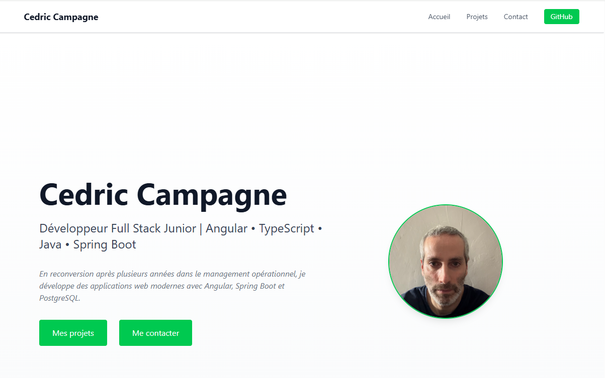

# Portfolio – Angular & Spring Boot

<p align="center">


</p>

---

# 🚀 Live Demo

🌐 **Application**

https://portfolio-a-wine.vercel.app

🔗 **REST API**

https://portfolio-a-8yeu.onrender.com

📦 **Repository**

https://github.com/CedricCampagne/portfolio-A

---

# 📖 About

This project is my personal portfolio developed during my transition into Full-Stack Development.

Rather than building a simple static website, I wanted to create a complete modern web application using the technologies I am targeting professionally: **Angular** and **Spring Boot**.

The application follows a real frontend/backend architecture where the Angular client communicates with a REST API developed with Spring Boot, while the data is stored in a PostgreSQL database.

The project also allowed me to gain practical experience deploying a complete application in the cloud using modern deployment platforms.

---

# ✨ Features

* Responsive interface
* Dynamic projects loaded from a REST API
* Project detail pages using slug routing
* Standalone Angular components
* REST API built with Spring Boot
* PostgreSQL persistence
* Database versioning with Flyway
* Environment management (Development / Production)
* Full cloud deployment

---

# 🏗 Architecture

```text
                   Angular
                  (Vercel)

                      │
                HTTP / REST

                      ▼

          Spring Boot REST API
                (Render)

                      │
             Spring Data JPA

                      ▼

         PostgreSQL Database
              (Supabase)
```

---

# 🛠 Tech Stack

| Layer               | Technologies                         |
| ------------------- | ------------------------------------ |
| Frontend            | Angular 21, TypeScript, Tailwind CSS |
| Backend             | Spring Boot 4, Java 21               |
| Database            | PostgreSQL                           |
| ORM                 | Spring Data JPA                      |
| Database Migrations | Flyway                               |
| Build Tool          | Maven                                |
| Backend Deployment  | Render (Docker)                      |
| Frontend Deployment | Vercel                               |
| Database Hosting    | Supabase                             |
| Version Control     | Git & GitHub                         |

---

# 📂 Project Structure

```text
portfolio-A/

├── api/
│   ├── config/
│   ├── controller/
│   ├── dto/
│   ├── entity/
│   ├── mapper/
│   ├── repository/
│   ├── service/
│   └── ...

├── front/
│   ├── src/
│   ├── app/
│   ├── components/
│   ├── pages/
│   └── ...

└── README.md
```

---

# 📸 Screenshots

## Home Page

> *(Add a screenshot in `assets/home.png`)*

```markdown

```

---

## Project Details

> *(Add a screenshot in `assets/project-details.png`)*

```markdown

```

---

# ⚙ Running Locally

## Clone the repository

```bash
git clone https://github.com/CedricCampagne/portfolio-A.git
```

---

## Frontend

```bash
cd front
npm install
ng serve
```

Application available at:

```text
http://localhost:4200
```

---

## Backend

Configure the following environment variables:

```text
DB_URL
DB_USERNAME
DB_PASSWORD
```

Run the application:

```bash
cd api
./mvnw spring-boot:run
```

API available at:

```text
http://localhost:8080
```

---

# 📚 What I Learned

This project helped me strengthen my skills in:

* Angular Standalone Components
* TypeScript
* Java
* Spring Boot
* REST API design
* Spring Data JPA
* PostgreSQL
* Flyway database migrations
* Docker
* Environment configuration
* CORS configuration
* Git workflow
* Full-stack application deployment
* Cloud hosting with Vercel, Render and Supabase

---

# 🚀 Future Improvements

Planned improvements include:

* Additional projects
* Improved animations and UI
* Enhanced accessibility
* Performance optimizations
* Admin interface for content management
* Additional portfolio sections

---

# 👨‍💻 Author

**Cédric Campagne**

Junior Full-Stack Developer

This portfolio showcases my learning journey and my ability to design, build and deploy a modern full-stack application using Angular, Spring Boot and PostgreSQL.
